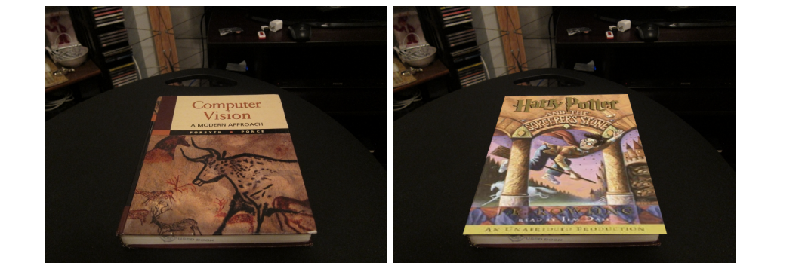
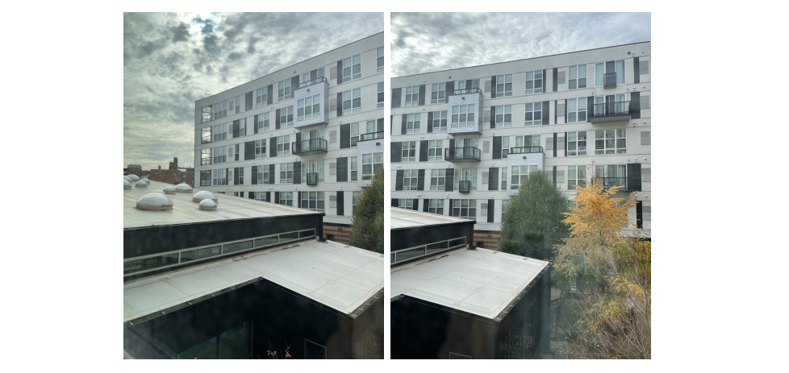
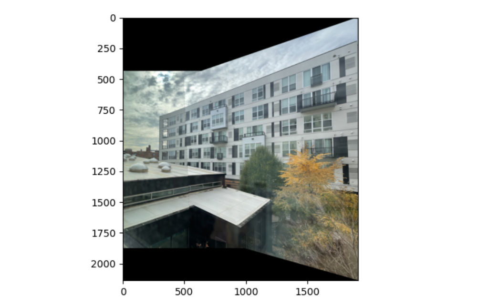

<!--https://github.com/othneildrew/Best-README-Template-->

  <h3 align="center">Augmented Reality with Planar Homographies</h3>
  

    16-720 Computer Vision: Homework 3 · Fall 2022
  

<!-- ABOUT THE PROJECT -->
## About The Project

Implementing an AR application step by step using planar homographies. Finding point correspondences between two images and use these
to estimate the homography between them. Then using this homography to warp images and finally implement it on AR applications.

### Built With: 
* Python 
* NumPy

<!-- Results  -->
## Results 

_For the entire report, please refer to the [Documentation](https://example.com)_

1. Feature Detection and Matching

2. RANSAC for Homography Computation

3. Augmented Reality application

4. Panorama Image Generation Using Homography 

(<a href="#readme-top">back to top</a>)
